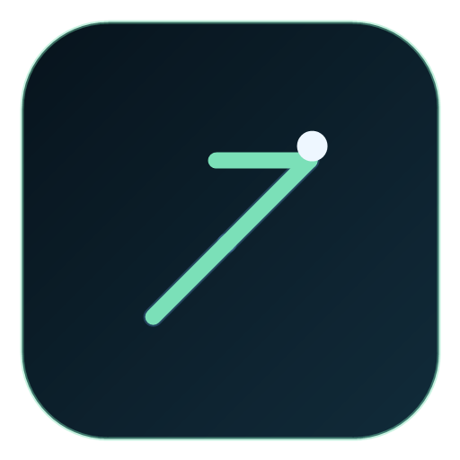

# LoL Item Coach



This is an Electron desktop assistant for League of Legends. It reads Riot's local Live Client API on `https://127.0.0.1:2999/liveclientdata/allgamedata`, then ranks item options from:

- a class-based meta prior for your champion archetype
- current enemy damage split by threat
- the most fed enemy right now
- your current item state and how close you are to finishing an item

## Desktop app

1. Open PowerShell in the repository root directory
2. Install dependencies:

```powershell
npm.cmd install
```

3. Run the Electron app:

```powershell
node_modules\\.bin\\electron.cmd .
```

The app opens a desktop window and registers itself to launch at Windows sign-in. This is intentionally done with Windows startup registration, not a classic Windows Service, because Services cannot reliably show an interactive Electron UI in the user's desktop session.

## Web debug mode

If you want the original browser version for debugging:

```powershell
node server.js
```

## Notes

- If League is not currently in game, the UI will show a connection warning.
- Use the `Load mock match` button to test the UI without opening League.
- Static Riot patch data is cached in `.cache` after the first run.
- The app enables Windows startup when it launches.

## Current scoring model

`score = meta-fit + live-counter-fit + fed-threat bonus + build-path bonus + affordability`

This v1 is intentionally heuristic. The "meta" part is not scraped from U.GG/Lolalytics yet; it is a class-based prior derived from Riot champion tags and item stats. That keeps the PoC simple and stable enough to try immediately.

## Packaging

Build an MSI on Windows with:

```powershell
npm.cmd run dist
```

